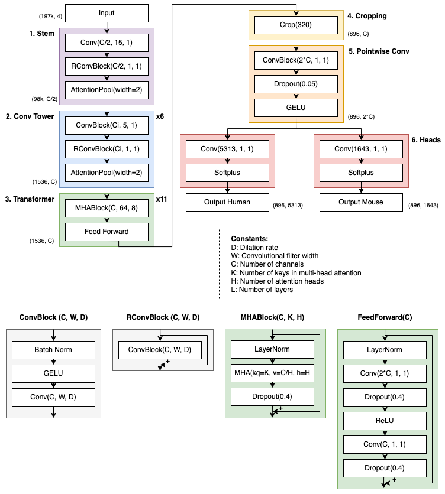
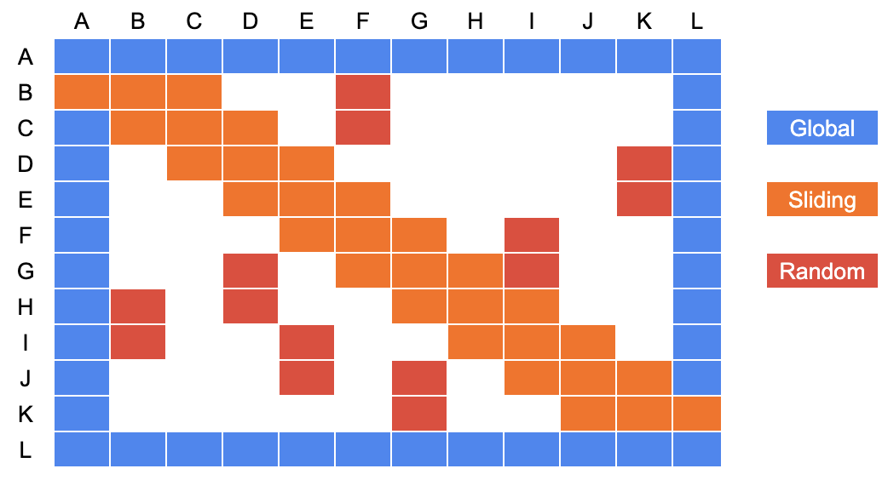
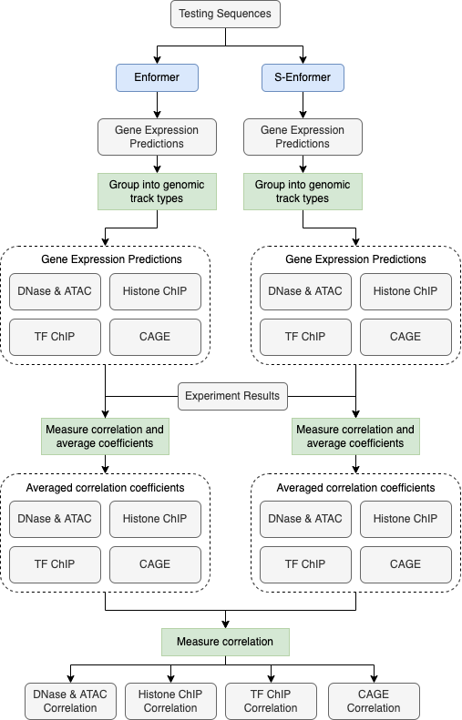

## Model architecture

The S-Enformer architecture is a combination of the Enformer[^1] and BigBird[^2] models. At a high level, S-Enformer is composed of the six parts (<a href=http://msc.bc.ic.ac.uk/~dgc21/methods/#figure-9-model-architecture>Figure 9</a>): (1: Stem) convolution blocks with attention pooling, (2: Convolutional tower) 6 convolutional blocks with batch normalisation and attention pooling, (3: Transformers) 11 transformer blocks with layer normalisation, sparse-attention, and dropout, (4: Cropping) a cropping layer, (5: Pointwise convolution) a pointwise convolution with dropout and a Gaussian error linear unit (GELU) activation function, and (6: Heads) a network head for each organism consisting of a dense layer and softplus activation function. Tensorflow v2.4.1[^3] and Sonnet v2.0.0[^4] were the primary libraries for developing the model.

### Figure 9: Model architecture
<figure markdown>
  { width="900" }
  <figcaption>
    The architecture of the Enformer and S-Enformer models. The image above is largely based on <a href=https://www.nature.com/articles/s41592-021-01252-x/figures/5>Extended Figure 1</a> from the Enformer paper. Given that the only architectural difference between Enformer and S-Enformer is the type of attention, the same diagram can be used to illustrate both models. The lower set of flowcharts provide greater detail about some of the components in the upper image.
  </figcaption>
</figure>

The input to S-Enformer is a 3-D matrix with dimensions for batch size, sequence length, and nucleotides. The batch size was set to 5, but it can vary based on the training requirements, the sequence length is always 196,608 bp, and there are 4 nucleotides (corresponding to A = [1,0,0,0], C = [0,1,0,0], G = [0,0,1,0], T = [0,0,0,1], N = [0,0,0,0]). When an input sequence is fed into S-Enformer, it is first reduced in length to 1,536 by the attention pooling in the stem and convolutional tower. Then, distal interactions within the sequence are learned by the transformer blocks. The cropping layer removes 320 positions at both ends of the sequence as the Enformer model could not share information to these edges from the opposite half of the sequence[^1]. It is possible for this layer to be removed so that more nodes connect with the pointwise convolutional layer and potentially increase the accuracy of the model, but changing the model architecture this significantly was outside the scope of this work. In the last section of the model, it predicts the genomic tracks for the relevant organism. There are 5,313 tracks for humans and 1,643 for mice, each of length 896, which correspond to a DNA sequence length of 114,688 bp aggregated into 128 bp bins.

### Sparse attention

The multi-head attention layers help the transformer blocks to learn the relationship between DNA sequence and expression levels. This is done by having each head (eight were used in S-Enformer) attend to the sequence separately, thereby learning different relationships between the DNA sequence and expression level. The output of these heads are concatenated and linearly transformed to be used as input by the next step in the transformer block[^5]. Within each attention head, it is the sparse-attention mechanism that allows the model to learn these relationships with a linear (as opposed to quadratic) dependency on memory. There are three components to sparse-attention: (1) random attention, (2) sliding attention, and (3) global attention (<a href=http://msc.bc.ic.ac.uk/~dgc21/methods/#figure-10-the-three-components-of-sparse-attention>Figure 10</a>).

### Figure 10: The three components of sparse-attention
<figure markdown>
  { width="600" }
  <figcaption>
    This diagram illustrates which tokens are attended to when using sparse-attention. Global attention is used by the first and last token as they are connected to all other tokens. Sliding attention is when a token attends to its neighbouring tokens. Random attention is used by random tokens attending to other ones. They are shown in pairs to demonstrate the use of blocks by BigBird’s sparse-attention mechanism, i.e. groups of tokens attend to each other, rather than individual tokens. This is a simplified diagram of S-Enformer’s sparse-attention as each square represents 64 tokens, which is the block size of the model.
  </figcaption>
</figure>

Random attention is when a subset of tokens attend to other tokens. This allows information to be shared across the network, but without the memory requirements of full attention. 192 tokens (of the 1,536) are randomly attended to in each layer.

Sliding attention makes use of the <a href=https://en.wikipedia.org/wiki/Locality_of_reference>locality of reference</a>. In a DNA sequence (and natural language processing in general), a significant amount of information can be learned about a token from its neighbouring tokens[^2]. In S-Enformer, a token attends to 64 tokens to the left and right of itself to capture the local information.

Global attention is when a token attends to all other tokens in a sequence. For S-Enformer, global attention is used by the first and last 64 tokens of a sequence. In comparison, all tokens use global attention in Enformer, therefore it can be another term for self-attention. The benefit of global attention is that it can help information to move much faster in a network than relying on just sliding or random attention, as global tokens are connected with all other tokens.

An issue with this attention is that sparse multiplication is inefficient when training a model on a GPU[^6],[^7]. To overcome this, query tokens and key tokens are grouped together into attention blocks (instead of being uniformly distributed). This allows matrix multiplication to be used, rather than a gather operation, which is much faster. Since sparse-attention is being used, the time complexity is linear, O(nbd) (n = number of tokens, b = block size, d = number of tokens to attend to), instead of quadratic, O(n2d), for self-attention[^2]. This results in fewer than half of nodes being attended to in each layer using sparse-attention, compared to all nodes attending to all others in each layer using self-attention.

## Modelling data

S-Enformer was trained, validated, and tested using the same data as Enformer[^1]. There are 34,021 training, 2,213 validation, and 1,937 test sequences for the human genome, and 29,295 training, 2,209 validation, and 2,017 test sequences for the mouse genome. For the human genome, each example contains 684 DNase-seq or ATAC-seq, 1,860 histone modification ChIP–Seq, 2,131 TF ChIP-Seq, and 638 CAGE tracks (totalling 5,313). For the mouse genome, each example contains 228 DNase-seq or ATAC-Seq, 750 histone modification ChIP–Seq, 308 TF ChIP–Seq, and 357 CAGE tracks (totalling 1,643).

## Model training

The model was trained for 25,000 steps using a batch size of 5 on a single RTX 6000 GPU, which took about 3 days. The Adam optimizer with a learning rate of 0.0001 was used to train S-Enformer, which is less than the final learning rate of 0.0005 for Enformer. The higher rate used by Enformer resulted in lower Pearson correlation coefficients for S-Enformer on the training and validation data. The same architecture parameters were used as Enformer, specifically 1,536 channels, 8 attention heads, and 11 transformer blocks.

A <a href=https://tfhub.dev/deepmind/enformer/1>pre-trained Enformer</a> model, shared by its authors, was used when comparing the performance against S-Enformer.

## Memory usage and training speed

A model’s memory usage and training speed was measured across 10 training steps using a batch size of 1 on a single RTX 6000 GPU. The peak memory usage was reported using the <a href=https://www.tensorflow.org/api_docs/python/tf/config/experimental/get_memory_info>tf.config.experimental.get_memory_info</a> function. After each training step, the memory stats were reset so that an average could be taken across the first 10 steps. Measuring the training time began just before the first training step and concluded once the tenth training step had finished.

## Accuracy evaluation

Only the human testing dataset was used to compare the performance between the two models. The mouse testing data was omitted as the human data was sufficient to make a fair comparison and we are more interested in these results. The Pearson correlation coefficient was reported for each of the four genomic tracks: (1) DNase-Seq and ATAC-Seq, (2) histone modifications ChIP-Seq, (3) TF ChIP-Seq, and (4) CAGE. <a href=https://www.nature.com/articles/s41592-021-01252-x#Sec18>Supplementary Table 2</a> from the Enformer paper was used to label the track type within each of the 5,313 testing examples. The mean Pearson correlation coefficient was reported for each track type to compare the performance between Enformer and S-Enformer.

## Measuring the correlation of predictions

The correlation between Enformer’s and S-Enformer’s predictions were measured using the 1,939 testing sequences (the workflow is illustrated in <a href=http://msc.bc.ic.ac.uk/~dgc21/methods/#figure-11-workflow-to-measure-the-correlation-of-predictions>Figure 11</a>). Each sequence was inputted into the two models to collect the gene expression for the 5,313 genomic tracks. The tracks were then grouped into their four genomic track types and had their (Pearson) correlation measured with the experimental results to evaluate their quality. For each of the 1,939 testing sequences, the correlations were averaged within the four track types. The two model’s averaged-correlation values were then correlated (Pearson) with each other to understand the similarity between predictions.

### Figure 11: Workflow to measure the correlation of predictions
<figure markdown>
  { height=200 }
  <figcaption>
    The workflow to measure the correlation of predictions from Enformer and S-Enformer within the four genomic track types. First, the testing sequences are fed into the models to predict gene expression. Then the predictions are grouped into their genomic track types before being correlated with the experiment results. The correlations are averaged within each genomic track type. Finally the averaged correlation coefficients for the two models are correlated with each other to help understand the similarity of predictions.
  </figcaption>
</figure>

To determine how often S-Enformer outperformed Enformer, the averaged-correlation values were compared, within each track type, to measure the percentage of the testing examples that S-Enformer had a higher average correlation than Enformer.

## Receptive field

The receptive field for a model was measured by: (1) taking a random sequence of DNA (length = 196,608), (2) predicting the expression across all 5,313 genomic tracks, (3) randomly changing a single base at a predefined location (such as the first nucleotide), (4) again predicting the expression across all 5,313 genomic tracks, (5) calculating the difference in expression between the two sets of predictions, (6) repeating steps 1-5 one hundred times, and (7) averaging the change in expression for the 896 position across the 5,313 genomic tracks. These seven steps were repeated nine times, each using a different mutation location. The nine locations were equally spaced across the sequence of DNA.

[^1]: Avsec, Žiga, Vikram Agarwal, Daniel Visentin, Joseph R. Ledsam, Agnieszka Grabska-Barwinska, Kyle R. Taylor, Yannis Assael, John Jumper, Pushmeet Kohli, and David R. Kelley. 2021. ‘Effective Gene Expression Prediction from Sequence by Integrating Long-Range Interactions’. Nature Methods 18 (10): 1196–1203. <a href=https://doi.org/10.1038/s41592-021-01252-x>https://doi.org/10.1038/s41592-021-01252-x</a>.
[^2]: Zaheer, Manzil, Guru Guruganesh, Avinava Dubey, Joshua Ainslie, Chris Alberti, Santiago Ontanon, Philip Pham, et al. 2021. ‘Big Bird: Transformers for Longer Sequences’. ArXiv:2007.14062 [Cs, Stat], January. <a href=http://arxiv.org/abs/2007.14062>http://arxiv.org/abs/2007.14062</a>.
[^3]: TensorFlow Developers. 2022. TensorFlow (version v2.8.2). Zenodo. <a href=https://doi.org/10.5281/ZENODO.4724125>https://doi.org/10.5281/ZENODO.4724125</a>.
[^4]: Sonnet Developers. 2020. Sonnet Documentation — Sonnet Documentation (version v2.0.0). <a href=https://sonnet.readthedocs.io/en/latest/>https://sonnet.readthedocs.io/en/latest/</a>.
[^5]: Vaswani, Ashish, Noam Shazeer, Niki Parmar, Jakob Uszkoreit, Llion Jones, Aidan N. Gomez, Lukasz Kaiser, and Illia Polosukhin. 2017. ‘Attention Is All You Need’. ArXiv:1706.03762 [Cs], December. <a href=http://arxiv.org/abs/1706.03762>http://arxiv.org/abs/1706.03762</a>.
[^6]: Gale, Trevor, Matei Zaharia, Cliff Young, and Erich Elsen. 2020. ‘Sparse GPU Kernels for Deep Learning’. ArXiv:2006.10901 [Cs, Stat], August. <a href=http://arxiv.org/abs/2006.10901>http://arxiv.org/abs/2006.10901</a>.
[^7]: Yao, Zhuliang, Shijie Cao, Wencong Xiao, Chen Zhang, and Lanshun Nie. 2019. ‘Balanced Sparsity for Efficient DNN Inference on GPU’. Proceedings of the AAAI Conference on Artificial Intelligence 33 (July): 5676–83. <a href=https://doi.org/10.1609/aaai.v33i01.33015676>https://doi.org/10.1609/aaai.v33i01.33015676</a>.
