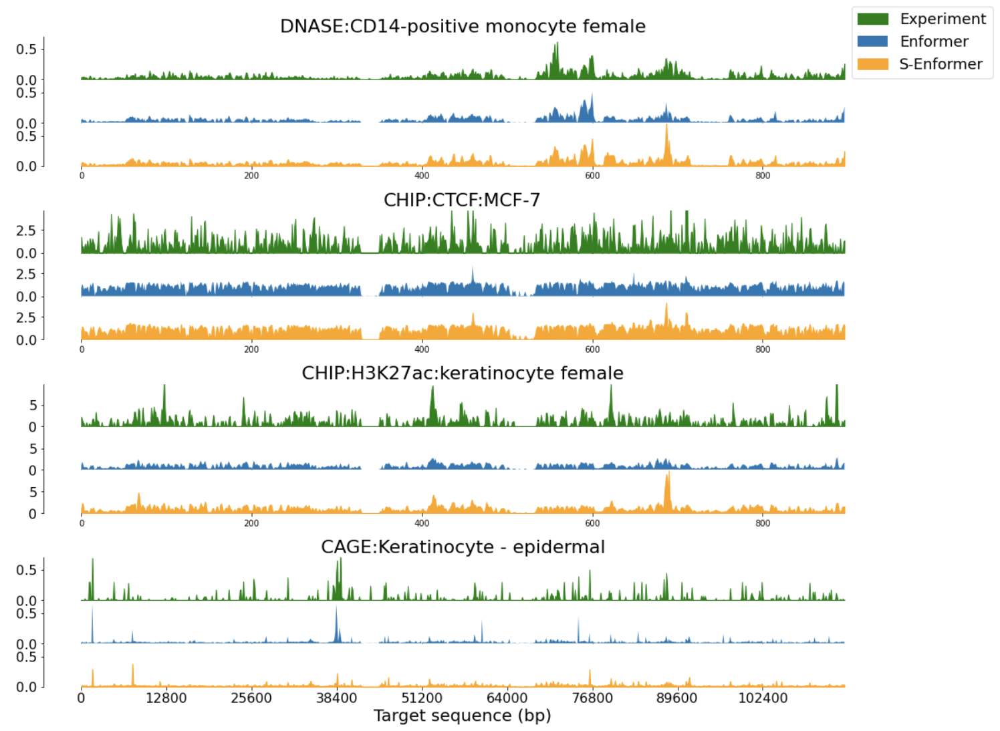
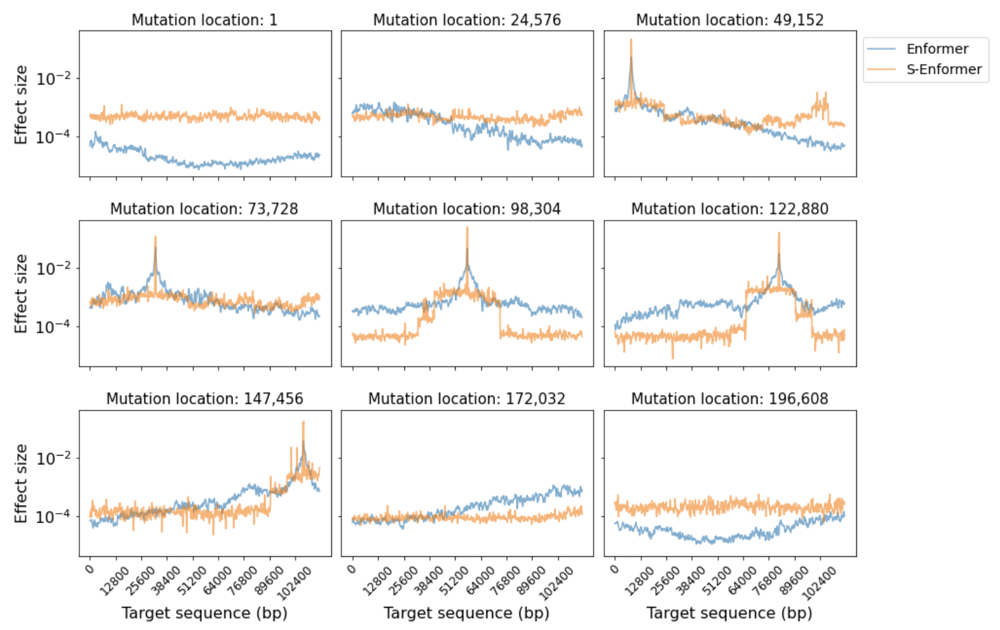

## Benefits in memory usage with longer sequences

To understand how sparse-attention affected the memory usage of the model, the input sequence length was increased from 131,072 bp to 786,432 bp (<a href=http://msc.bc.ic.ac.uk/~dgc21/results/#figure-1-memory-usage-increases-with-dna-sequence-length-11-vs-1-transformer-layers>Figure 1</a>). To further clarify the impact of the attention method on the difference in memory usage, it was also measured when just one transformer layer was used (<a href=http://msc.bc.ic.ac.uk/~dgc21/results/#figure-1-memory-usage-increases-with-dna-sequence-length-11-vs-1-transformer-layers>Figure 1</a>). The difference between the memory usage when using one transformer layer, versus the original eleven, provides an estimate of the memory required for each additional transformer layer (<a href=http://msc.bc.ic.ac.uk/~dgc21/results/#figure-2-average-memory-usage-depending-on-sequence-length>Figure 2</a>).

### Figure 1: Memory usage increases with DNA sequence length (11 vs 1 transformer layers)
<iframe width="900" height="375" frameborder="0" scrolling="no" src="//plotly.com/~Currie32/30.embed?showlink=false"></iframe>

    <figcaption>
        Memory usage scales quadratically with sequence length when the model uses self-attention. This compares to the linear scaling when sparse-attention is employed by the model. Using only one transformer layer illustrates the baseline memory usage for the model and highlights the magnitude of the difference between self- and sparse-attention.
    </figcaption>

The results when using eleven transformer layers show a clear trend that the memory usage for self-attention scales quadratically compared to the linear increase for sparse-attention. With sparse-attention, the model can handle sequence lengths of 786,432 bp, while the model runs out of memory (>24 GB) when using self-attention and a sequence length of 589,824 bp. The average memory usage per transformer layer provides further evidence for the difference in requirements between the two methods (<a href=http://msc.bc.ic.ac.uk/~dgc21/results/#figure-2-average-memory-usage-depending-on-sequence-length>Figure 2</a>). Each transformer layer requires less memory when using sparse-attention with a sequence length of 786,432 bp than when using self-attention with a sequence length of 393,216 bp.

### Figure 2: Average memory usage depending on sequence length
<iframe width="900" height="365" frameborder="0" scrolling="no" src="//plotly.com/~Currie32/35.embed?showlink=false"></iframe>

    <figcaption>
        At shorter sequence lengths, self-attention uses less memory per attention layer than sparse-attention, but this metric quickly reverses. At a sequence length of ~300k bp, the two attention mechanisms are equal. This plot can serve as a guide to help developers choose the sequence length and number of layers that are appropriate for their tasks and computation resources.
    </figcaption>

Despite the benefits of using sparse-attention with longer sequences, they have a cost when using shorter sequence lengths. Until the sequence length reaches approximately 300,000 bp, self-attention uses less memory than sparse-attention.

## Memory usage and runtime trade-off

At many of the analysed sequence lengths, training a model using sparse-attention is slower than using self-attention (<a href=http://msc.bc.ic.ac.uk/~dgc21/results/#figure-3-slower-training-with-sparse-attention>Figure 3</a>). This was true whether one or eleven transformer layers were used in the model. This result is consistent with other sparse-attention models, including Performer[^1] and Reformer[^2]. This suggests that the method these models use to achieve linear memory dependency has a computational cost until the input is of a sufficient size.

### Figure 3: Slower training with sparse-attention
<iframe width="900" height="300" frameborder="0" scrolling="no" src="//plotly.com/~Currie32/38.embed?showlink=false"></iframe>

    <figcaption>
        Training the model is slower with sparse-attention at many of the tested sequence lengths. Given that a model needs to be trained for thousands of steps, using sparse-attention significantly increases the duration of training.
    </figcaption>

The Long-Range Arena benchmark[^3], which compares memory-efficient Transformers against the vanilla Transformer in a range of tasks, provides further evidence of the computational speed of BigBird’s sparse-attention mechanism. BigBird trained slower than the vanilla Transformer until the input sequence length was greater than 3,000. Compared to the other memory efficient Transformers, it was the second slowest (out of eight) to train[^3].

## Accuracy results could not be reproduced

The authors <a href=https://tfhub.dev/deepmind/enformer/1>released</a> a pre-trained version of Enformer. To confirm its performance matched the results in its paper, <a href=https://www.nature.com/articles/s41592-021-01252-x/figures/1>Figure 1c</a>[^4], we ran the model evaluation code that the authors shared (see the <a href=https://github.com/deepmind/deepmind-research/blob/master/enformer/enformer-training.ipynb>evaluate_model</a> function). Adjustments were made to this code to measure the performance on the four genomic track types, instead of averaging all of the tracks together. Despite the change, the methodology remained the same. The four genomic track types are: (1) DNA accessibility, which was measured using deoxyribonuclease sequencing (DNase-Seq) and assay of transposase accessible chromatin sequencing (ATAC-Seq), (2) histone modification chromatin immunoprecipitation and sequencing (ChIP-Seq), (3) transcription factor (TF) ChIP-Seq, and (4) cap analysis of gene expression (CAGE)[^5]. Each testing example has its corresponding track listed in <a href=https://www.nature.com/articles/s41592-021-01252-x#Sec18>Supplementary Table 2</a>.

We could not reproduce the results from their paper (<a href=http://msc.bc.ic.ac.uk/~dgc21/results/#figure-4-difference-in-enformers-performance>Figure 4</a>) and it is unclear why this is the case. The authors of the paper were contacted about this matter, but they did not provide an explanation for the difference. Going forward in this report, our results for Enformer will be used as the benchmark to provide a fair comparison against S-Enformer.

### Figure 4: Difference in Enformer's performance
<iframe width="900" height="300" frameborder="0" scrolling="no" src="//plotly.com/~Currie32/42.embed?showlink=false"></iframe>

    <figcaption>
        The Pearson correlation results from the paper could not be reproduced. The difference between our results and Avsec et al’s paper’s vary considerably. The largest difference in the Pearson correlation coefficients is 0.129, for the TF ChIP-Seq tracks, while the smallest difference is 0.021, for the CAGE tracks.
    </figcaption>

## Achieving accuracy parity might require training the full model

We attempted to achieve accuracy parity with Enformer by training S-Enformer, but only updating the weights in the sparse-attention layers. This method is similar to fine-tuning, as all of the weights were frozen except for those in the new layers. Also like fine-tuning, the benefit of this method is that it could save a significant amount of time and computational resources compared to retraining the model from scratch. Enformer was trained on 64 tensor processing units (TPU) v3 cores with a batch size of 64 (1 per core) for 150,000 steps over approximately 3 days[^4]. Reducing this training process to more modest levels could help to make updating state-of-the-art models more accessible. When fine-tuning a model, it has been shown that performance parity can be achieved from just a few hours of training on a single GPU[^6]. However, after training the model for 25,000 steps, with a batch size of 5 over 3 days, we were unable to achieve the same Pearson correlation coefficients as Enformer (<a href=http://msc.bc.ic.ac.uk/~dgc21/results/#figure-5-performance-parity-could-not-be-achieved>Figure 5</a>).

### Figure 5: Performance parity could not be achieved

=== "5a. Performance comparison after training"

    <iframe width="900" height="350" frameborder="0" scrolling="no" src="//plotly.com/~Currie32/40.embed?showlink=false"></iframe>
    

        <figcaption>
            The performance after training S-Enformer for 25,000 steps with a batch size of 5 compared to the pre-trained Enformer. Enformer still outperforms S-Enformer on all four of the genomic track types.
        </figcaption>
    

=== "5b. Performance comparison during training"

    <iframe width="670" height="350" frameborder="0" scrolling="no" src="//plotly.com/~Currie32/33.embed?showlink=false"></iframe>
    

        <figcaption>
            S-Enformer could not achieve the same performance as Enformer after being trained for 25,000 steps with a batch size of 5. Its performance metrics were still improving at the end of the three days of training, so it is possible that parity could be achieved with further training.
        </figcaption>
    

Since much of S-Enformer was pretrained when we began retraining, it quickly achieves non-trivial performance. Progress quickly slows, but is still continuing at the 25,000th step. It is possible that using different training parameters and further training steps could result in performance parity, but due to time limitations and parameter optimization not being the primary focus of this work, these possibilities were not explored.

## Highly correlated predictions

To better understand the difference between Enformer and S-Enformer, the performance of their predictions were plotted together (<a href=http://msc.bc.ic.ac.uk/~dgc21/results/#figure-6-the-models-predictions-are-highly-correlated>Figure 6</a>). It is clear that the predictions are highly correlated, as the Pearson correlation coefficient for the genomic track types range from 0.863 to 0.962. Although all of the correlations are high, their range is noticeable. The results for the TF ChIP tracks are clustered tightly together, but the CAGE tracks can have significant differences. It is also noticeable that Enformer regularly, but not always, outperforms S-Enformer. S-Enformer outperforms Enformer in ~15% of testing examples on the DNase & ATAC and CAGE tracks, but only ~3% of histone modification ChIP tracks. Further investigation of this work is required to understand the cause of these discrepancies.

### Figure 6: The models' predictions are highly correlated
<figure markdown>
  { width="650" }
  <figcaption>
    S-Enformer’s and Enformer’s predictions are highly correlated. This is expected given the architectural and performance similarities. It is interesting that the correlations vary so much between the genomic track types and it is unclear why this is the case.
  </figcaption>
  

</figure>

Looking at a set of genomic tracks provides some insight into how Enformer and S-Enformer predict the results from experiments (<a href=http://msc.bc.ic.ac.uk/~dgc21/results/#figure-7-much-of-the-expression-variance-is-captured-by-the-models>Figure 7</a>). The models captured much of the variance and some of the main peaks in the tracks, but can struggle if there is significant variation over a short sequence of DNA. From calculating the mean and median gene expression for each track in the testing data, Enformer and S-Enformer both tend to overpredict compared to the experimental results.

### Figure 7: Much of the expression variance is captured by the models
<figure markdown>
  { width="900" }
  <figcaption>
    A prediction from each model on the four genomic track types alongside the experiment results. This comparison helps to illustrate the shortcomings of the models. They can capture a substantial amount of the variance in the genomic tracks and predict some of the main peaks, but struggle with large variation within a small range.
  </figcaption>
</figure>

## Sparse attention still uses the entire receptive field

The receptive field of the model was measured to confirm that no reduction was made by replacing the self-attention layers with sparse-attention. The results in <a href=http://msc.bc.ic.ac.uk/~dgc21/results/#figure-8-the-receptive-field-is-still-in-full-use>Figure 8</a> illustrate that the model’s receptive field still encompasses the entire input sequence. This means that a change in nucleotide at any base will result in a change in the predicted gene expression across an entire track.

### Figure 8: The receptive field is still in full use
<figure markdown>
  { width="900" }
  <figcaption>
    S-Enformer’s and Enformer’s receptive fields are both equal to the full length of the input sequence. This means that any change to the input sequence will result in a change to the predicted gene expression levels. However, how a mutation affects their predictions is different. S-Enformer is more affected by mutations that are towards the end of the input sequence, while Enformer makes larger changes to its predictions when the mutation is towards the middle of the input sequence.
  </figcaption>
  

</figure>

There is a noticeable difference in how a mutation affects the predicted expression based on attention type. When a mutation is at the start or end of the input sequence, sparse-attention predicts a greater and more uniform change in gene expression than self-attention. The change in predicted expression by self-attention is skewed towards the mutation’s end of the sequence. When the mutation is towards the centre of the input sequence, both models have a visible peak where the change in predicted gene expression is most significant. A peak’s location in a genomic track is correlated with the mutation’s location in the input sequence. Sparse-attention differs from self-attention as its peak is greater and there is a more significant drop-off in the predicted change in gene expression as the distance increases from the peak.

[^1]: Choromanski, Krzysztof, Valerii Likhosherstov, David Dohan, Xingyou Song, Andreea Gane, Tamas Sarlos, Peter Hawkins, et al. 2021. ‘Rethinking Attention with Performers’. ArXiv:2009.14794 [Cs, Stat], March. <a href=http://arxiv.org/abs/2009.14794>http://arxiv.org/abs/2009.14794</a>.
[^2]: Kitaev, Nikita, Łukasz Kaiser, and Anselm Levskaya. 2020. ‘Reformer: The Efficient Transformer’. ArXiv:2001.04451 [Cs, Stat], February. <a href=http://arxiv.org/abs/2001.04451>http://arxiv.org/abs/2001.04451</a>.
[^3]: Tay, Yi, Mostafa Dehghani, Samira Abnar, Yikang Shen, Dara Bahri, Philip Pham, Jinfeng Rao, Liu Yang, Sebastian Ruder, and Donald Metzler. 2020. ‘Long Range Arena: A Benchmark for Efficient Transformers’. ArXiv:2011.04006 [Cs], November. <a href=http://arxiv.org/abs/2011.04006>http://arxiv.org/abs/2011.04006</a>.
[^4]: Avsec, Žiga, Vikram Agarwal, Daniel Visentin, Joseph R. Ledsam, Agnieszka Grabska-Barwinska, Kyle R. Taylor, Yannis Assael, John Jumper, Pushmeet Kohli, and David R. Kelley. 2021. ‘Effective Gene Expression Prediction from Sequence by Integrating Long-Range Interactions’. Nature Methods 18 (10): 1196–1203. <a href=https://doi.org/10.1038/s41592-021-01252-x>https://doi.org/10.1038/s41592-021-01252-x</a>.
[^5]: Forrest et al. 2014. ‘A Promoter-Level Mammalian Expression Atlas’. Nature 507 (7493): 462. <a href=https://doi.org/10.1038/nature13182>https://doi.org/10.1038/nature13182</a>.
[^6]: Devlin, Jacob, Ming-Wei Chang, Kenton Lee, and Kristina Toutanova. 2019. ‘BERT: Pre-Training of Deep Bidirectional Transformers for Language Understanding’. ArXiv:1810.04805 [Cs], May. <a href=http://arxiv.org/abs/1810.04805>http://arxiv.org/abs/1810.04805</a>.
